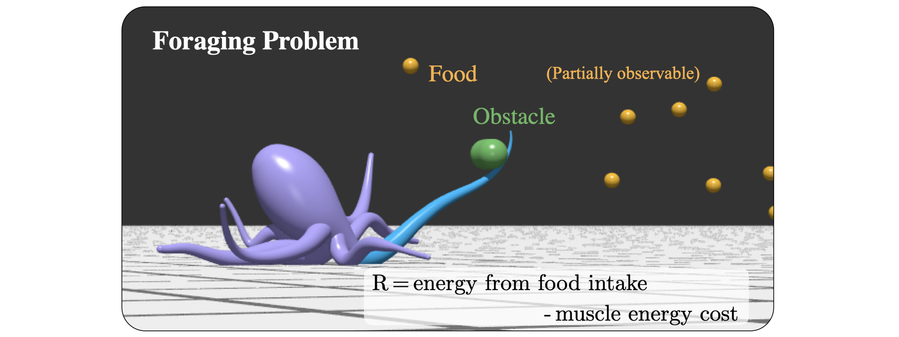
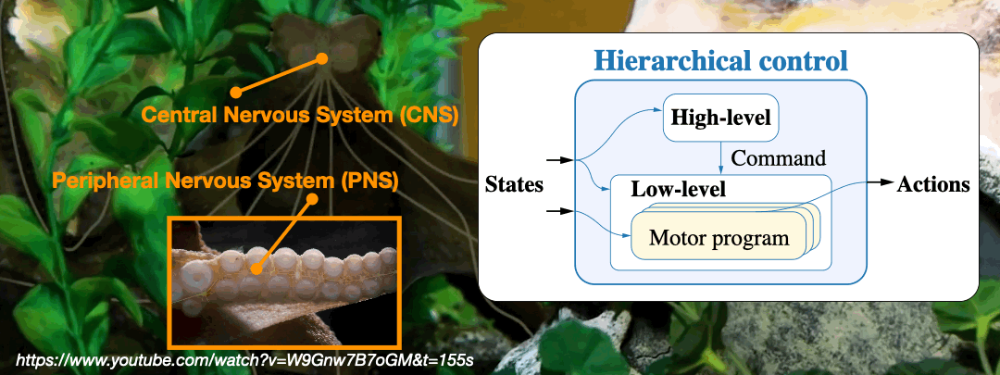
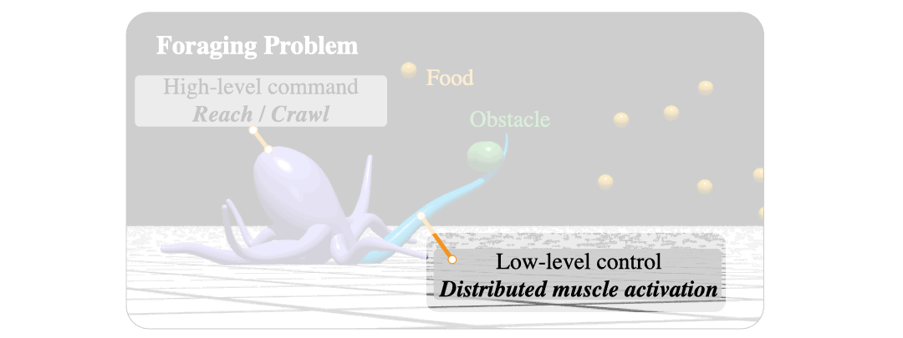
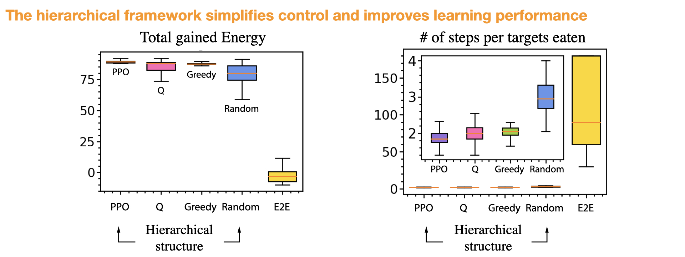
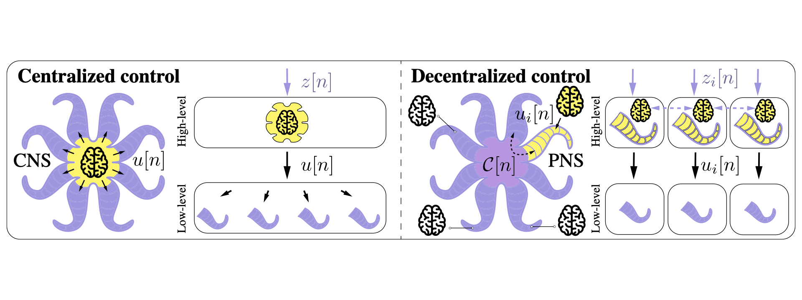
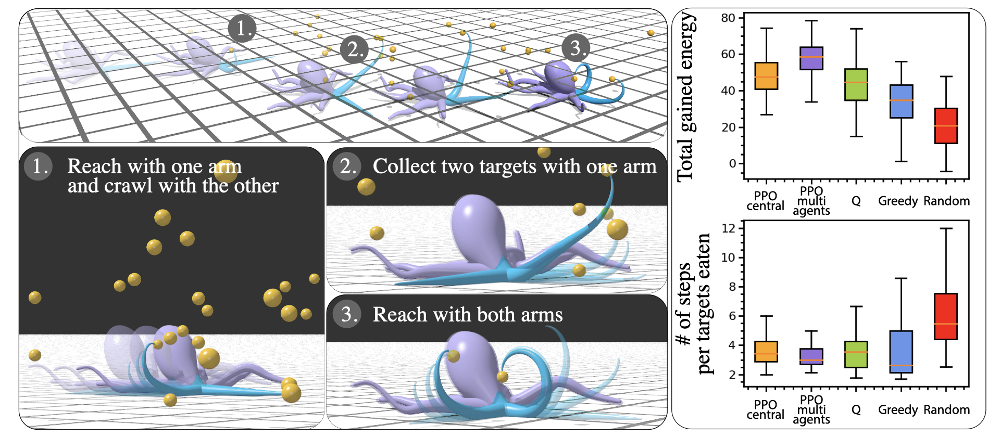
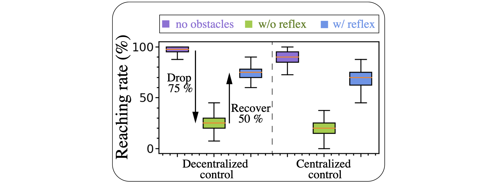

# Multi-arm coordination for foraging

Controlling multiple arms to perform complex tasks is challenging especially when planning with limited information is
involved. One example for an octopus robot is foraging food using multiple arms.


I place an octopus robot in an environment consists of random food targets, and it can only sense a few food targets
nearby. The foraging goal is to gained as much energy as it can to survive. The octopus robot needs to consider the
energy from food intake and the muscle energy cost. This task requires (1) controlling muscle activations for reaching
for
food ([Details of the muscle-activated soft arm model](https://github.com/chshih2/Real-time-control-of-an-octopus-arm-NNES))
(2) long-term planning on whether to reach for food or to coordinate arms to relocate to a new, more favorable position.

## Code

### Dependencies

```angular2html
conda create -n "forage" python=3.10
conda activate forage
pip install -r requirements.txt
```

### Train to forage

```angular2html
python run_forage.py
```

- Training requires pretrained [NNES controller](https://github.com/chshih2/Real-time-control-of-an-octopus-arm-NNES).
- Data can be downloaded [here](https://uofi.box.com/s/6wp521weiyevse2ner73wb6j2msbihht) and put into "nnes_model" folder. 
    - Input:
        - workspace shape: 0528_concave_hull_points.npy
        - basis functions of muscle activations: 0531_11activation.npz
        - pretrained model: pretrained_model.h5
    - Output: "logs" folder containing
        - trained model
        - tensorboard log

### Evaluation

```bash
python run_forage.py evaluation with n_sample=1 load_model="logs/DIR-TO-PPO/"
```

- Output number of targets collected for
    - PPO policy
    - random policy
    - greedy policy
    - simplified Q policy

### Customizing the training
- Thanks to [Seung Hyun Kim](https://github.com/skim0119), 
the code is cleaned up and integrated with [`sacred CLI`](https://sacred.readthedocs.io/en/stable/command_line.html) for easy reconfiguration.
- The default training configuration is stored in "config" folder
    - modify the yaml file, or
    - add `with` next to command line to change the parameter:

```bash
python run_forage.py with eps=0.3 batch_size=60 lr=1e-3
```


[//]: # (### Benchmark Other Methods)

[//]: # (- `e2e_rl`: end-to-end reinforcement learning without hierarchical structure.)

[//]: # (- )

## Hierarchical decomposition control

To solve this problem, I employ a hierarchical framework Inspired by the highly distributed neural system in an octopus.
An octopus has a highly distributed neural system that comprises a Central Nervous System and a Peripheral Nervous
System. While the central nervous system is responsible for learning and decision making by integrating signals from the
entire body, the Peripheral Nervous System is responsible for locally control the muscles.


Based on this, a two-level hierarchical framework can be constructed. At the central-level, strategic commands are
issued to the individual arms. Then, at the arm-level, embedded motor programs are executed to complete the selected
commands.



To solve the foraging problem for the soft octopus robot, I
employ [NN-ES](https://github.com/chshih2/Real-time-control-of-an-octopus-arm-NNES) as the fast-responding arm-level
controller for muscle activations. This enables the central-level controller to solve the foraging problem with
sequences of crawl and reach. Given the crawl command, a prescribed crawling muscle activation is applied. If reach is
selected, the arm attempts to reach all food targets within its workspace.

This high-level control problem is solved using Proximal Policy Optimization (PPO)[1]. Here is the demonstration of a
single arm using the framework. The strategy here reflects the consideration of the muscle energy cost, in the sense
that the octopus will crawl until a large number of food targets are within reach, to then fetch them all at once.


I evaluate the performance of PPO against four other approaches. The end-to-end approach has to learn the activations
from scratch without leveraging the intermediate command. The other three approaches have hierarchical structure with
different high-level controllers. A random controller selects crawl or reach with 50/50 probability. A ‘greedy’
controller selects reach whenever food is available, otherwise it selects crawl. Q is a policy derived from a simplified
problem with assumptions on the full-knowledge of the targets, simplified workspace shape and the constant cost
regardless of the muscle activations.


I evaluate their performance on the total gained energy, and average number of time steps per food target collected.
Overall, all four hierarchical policies (including the random policy) outperform the end-to-end approach. In addition,
among the hierarchical policies, the PPO policy not only collects food with less muscle energy costs, but also in a
fewer number of steps.

## Multi-arm coordination

For foraging with multiple arms, I formulate the multi-arm problem in two ways: a centralized approach and a
decentralized approach inspired by the two hypothesis in octopus control. The centralized approach is rooted in the
hypothesis that the CNS coordinates all high-level decision-making, so one agent controls the actions of all arms. For
the decentralized approach, it is based on that individual arms have been shown to possess a degree of independent
decision-making. I explore this paradigm by formulating the high-level control as a multi-agent problem where each arm
acts independently while contributing to learning via a shared-network policy.



For foraging with two arms, within the same training episodes, the decentralized approach outperforms the alternative
high-level controllers with more gained energy and fewer steps, while the analytical solution Q is comparable to the
centralized approach.


Finally, I implement the framework for foraging with four arms. At this stage, the analytical solution Q is no longer
available, this highlights the use of learning-based approaches. On top of that, this time the environment has randomly
generated obstacles. I employ the [sensory reflex](https://github.com/chshih2/Real-time-control-of-an-octopus-arm-NNES)
as the local-level controller to tackle this situation. The octopus crawls around to explore the arena and when the arm
detects targets, it will try to collect.


Both centralized and decentralized approaches successfully learn to forage when training without the presence of
obstacles, resulting in collecting on average 88% and 99% of the food. I then deploy both policied in an environment
littered with unmovable obstacles. Without further training, this leads the arms to arms becoming stuck, substantially
impairing foraging behavior, which now only achieves 21% (centralized) and 25% (decentralized) food collection. With
the [sensory reflex](https://github.com/chshih2/Real-time-control-of-an-octopus-arm-NNES), however, the octopus robot
successfully collects 67% (centralized) and 75% (decentralized) of the food in an adverse environment.


[1] Schulman, J., Wolski, F., Dhariwal, P., Radford, A., & Klimov, O. (2017). Proximal policy optimization algorithms.
arXiv preprint arXiv:1707.06347.
